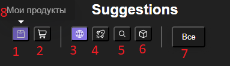

# Tusk Diet

**Culinary assistant & web-app inside a Telegram Bot**

Available at [Tusk Diet](https://t.me/TuskDietBot)

## Key Features

- Search recipes by ingredients
- Flexible recommendations by available ingredients lists
- Adding own recipes

## User Guide

### Recommendations Toolbar Legend

- Product lists
	1. Add ingredients in storage to search query
	2. Add ingredients in shopping list to search query
- Search modes

	3. Discovery: match recipes that contain ANY ingredients from lists and any more
	4. Accessible: show only recipes with all ingredients available in the included lists
	5. Precise: show recipes with exact ingresients match from all included lists
	6. Backboned: match recipes that contain ALL ingredients from lists and any more
7. Filter by categories
8. Hint appears on hovering over the element (PC only)

## TODO:

- Ingredients dictionary & nutrients data
- Rework UI & recipe schema
- Allow users to change any recipe (CloudStorage for recipe id & diff data)